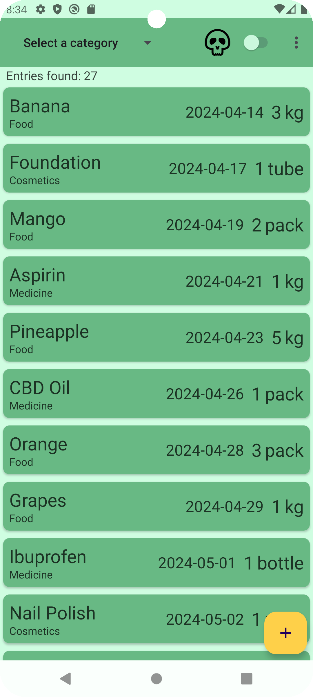

# Expiration Dates Scheduler

## Description
This project is a simple scheduler that allows you to set expiration dates for items.

## Features
- Add items with expiration dates
- View items with expiration dates
- Remove items with expiration dates
- View items that are expired
- Categorize items
- View items by category

